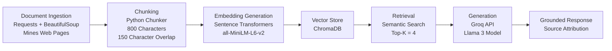

## Domain

This domain focuses on helping current and prospective Colorado School of Mines students navigate academics, campus resources, housing, dining, student organizations, and day-to-day campus life.A Retrieval-Augmented Generation (RAG) system can consolidate this knowledge into a searchable assistant that provides grounded answers to common student questions.

---

## Documents

| # | Source | Description | URL or Location |
|---|--------|-------------|----------------|
| 1 | CS@Mines Homepage | Department overview, programs, resources, and announcements | <https://cs.mines.edu/> |
| 2 | CS@Mines Student Resources | Academic support, career resources, and student services | <https://cs.mines.edu/students-resources/> |
| 3 | CS@Mines Faculty and Staff | Faculty profiles, advisors, and contact information | <https://cs.mines.edu/faculty-and-staff/> |
| 4 | CS@Mines MS Degree Program | Graduate degree requirements and program information | <https://cs.mines.edu/msdegree/> |
| 5 | Colorado School of Mines Contact Directory | University departments and student support contacts | <https://www.mines.edu/contact/> |
| 6 | Residence Life | Housing policies, residence halls, and student housing information | <https://www.mines.edu/residence-life/> |
| 7 | Campus Dining | Dining locations, meal plans, and food services | <https://www.mines.edu/dining/> |
| 8 | Career Center | Career services, internships, and job search resources | <https://www.mines.edu/career-center/> |
| 9 | Colorado School of Mines Subreddit | Student discussions, advice, and campus experiences | <https://www.reddit.com/r/ColoradoSchoolOfMines/> |
| 10 | New Student Orientation | Orientation programs and resources for incoming students | <https://www.mines.edu/new-student-orientation/> |

---

## Chunking Strategy

**Chunk size:**
Splitting the documents into chunks of approximately **800 characters** with an overlap of **150 characters**. This chunk size works well because my corpus contains a mix of short web pages, department information, and student resource pages. The official university pages are usually organised into sections and paragraphs.

**Overlap:**
The overlap helps preserve context when important information appears near the boundary between two chunks. For example, a page may mention a campus resource in one sentence and explain how students use it in the next sentence. Without overlap, the retriever may return only part of the answer.

**Reasoning:**
If chunks are too small, the system may retrieve fragments that lack sufficient context to answer the question. If chunks are too large, the retrieved text may include too much unrelated information, making the LLM less grounded. I will evaluate chunk quality by checking whether retrieved chunks are specific, relevant, and complete enough to answer test questions.

---

## Retrieval Approach

<!-- Which embedding model are you using (e.g., all-MiniLM-L6-v2 via sentence-transformers)?
     How many chunks will you retrieve per query (top-k)?
     If you were deploying this for real users and cost wasn't a constraint, what tradeoffs
     would you weigh in choosing a different embedding model — context length, multilingual
     support, accuracy on domain-specific text, latency? -->

**Embedding model:**
all-MiniLM-L6-v2 via sentence-transformers

**Top-k:**
Retrieving 4 chunks gives the LLM enough context without overwhelming it with unrelated text. If I retrieve too few chunks, the answer may miss important details. If I retrieve too many, the answer may become less focused or include irrelevant information.

**Production tradeoff reflection:**

Semantic search is useful because it can find related content even when the query and document do not use the exact same words. For example, a question about “career help” may retrieve chunks about the Career Center, internships, advising, or resume support.If this were deployed for real users and cost was not a constraint, I would compare stronger embedding models based on retrieval accuracy, context length, latency, cost, and performance on campus-specific language.

---

## Evaluation Plan

| # | Test Question | Expected Correct Answer |
|---|---------------|-------------------------|
| 1 | Where can students find university department contact information? | The system should point to the Colorado School of Mines Contact Directory and mention that it lists university departments and student support contacts. |
| 2 | Where can CS students find academic and career resources? | The system should identify the CS@Mines Student Resources page as a source for academic support, career resources, and student services. |
| 3 | Where can students learn about MS Computer Science degree requirements? | The system should reference the CS@Mines MS Degree Program page and explain that it contains graduate degree and program requirement information. |
| 4 | Where can students find information about campus dining? | The system should reference the Campus Dining page and mention dining locations, meal plans, and food services. |
| 5 | Where can students find unofficial student experiences or advice? | The system should reference the Colorado School of Mines subreddit as a source for student discussions, advice, and campus experiences. |

---

## Anticipated Challenges

One challenge is that the documents may contain noisy or inconsistent information. Official Mines pages may be structured and factual, while Reddit discussions may include opinions, outdated comments, or conflicting student experiences.

A second challenge is source attribution. The assistant should clearly show which source the answer came from so users can distinguish between official university information and informal student opinions.

Another risk is off-topic retrieval. A broad query like “Where should I go for help?” may retrieve unrelated chunks unless the documents are chunked and labeled carefully.

There is also a risk that chunk boundaries may split key information. Using overlap should reduce this issue, but I will still inspect retrieved chunks during testing.

---

## Architecture

---

## AI Tool Plan

I plan to use AI tools to help with implementation, debugging, and prompt design.
For chunking, I will provide ChatGPT or Claude with my chunking strategy, document types, and assignment requirements. I will ask it to implement a `chunk_text()` function using an 800-character chunk size and 150-character overlap.
For retrieval, I will provide the retrieval approach section and ask the AI to help implement embedding generation using `sentence-transformers` and storage using ChromaDB.
For response generation, I will provide the project requirements that the assistant must answer only from retrieved context. I will ask the AI to help write a grounded prompt template that tells the LLM to say when the answer is not found in the retrieved documents.
For debugging, I will use ChatGPT to interpret Python errors, especially issues related to Groq API calls, ChromaDB storage, and retrieval output formatting.

For evaluation, I will use AI tools to help refine test questions and expected answers, but I will manually verify whether the system responses are grounded in the retrieved source chunks.

**Milestone 3 — Ingestion and chunking:**

**Milestone 4 — Embedding and retrieval:**

**Milestone 5 — Generation and interface:**
