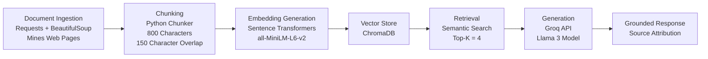

## Domain

This domain focuses on CS graduate student academic information at Colorado School of Mines, including degree requirements, registration policies, grading systems, graduation procedures, tuition policies, academic regulations, student conduct expectations, and graduate program offerings. While this information exists across multiple university documents and PDFs, it can be difficult for students to locate the correct policy quickly. This RAG system consolidates these resources into a searchable assistant that provides grounded answers based on official university documents.

---

## Documents

| # | Source | Type | Description | Location |
|---|--------|------|-------------|----------|
| 1 | Mines Mission, Vision and Strategic Planning | PDF | University mission, vision, core values, and strategic planning overview from the President's Office | `documents/Mines Mission, Vision and Strategic Planning - President's Office.pdf` |
| 2 | Colorado School of Mines Catalog | PDF | Official academic catalog covering the role, mission, degree programs, and educational philosophy of Mines | `documents/catalog.pdf` |
| 3 | Computer Science Graduate Programs | PDF | CS department degrees (MS, PhD, Professional MS, Cybersecurity Certificate), admission requirements, and research areas | `documents/cs.pdf` |
| 4 | Academic Regulations | PDF | Graduate school academic regulations including course registration rules, credit level policies, and program requirements | `documents/generalregulations.pdf` |
| 5 | Graduate Grading System | PDF | Graduate grade symbols, incomplete grade policies, satisfactory progress grades, and pass/fail rules | `documents/graduategradingsystem.pdf` |
| 6 | Graduation | PDF | Graduation application deadlines, commencement ceremony eligibility, and checkout procedures | `documents/graduation.pdf` |
| 7 | Graduation Requirements | PDF | Registration requirements for graduation, checkout steps, and links to deadline resources | `documents/graduationrequirements.pdf` |
| 8 | Policies and Procedures | PDF | Student code of conduct, academic integrity policy, misconduct definitions, and campus rules | `documents/policiesandprocedures.pdf` |
| 9 | Registration and Tuition Classification | PDF | Graduate registration rules, full-time credit loads, overload policy, research credit, and leave of absence procedures | `documents/registrationandtuitionclassification.pdf` |
| 10 | Robotics Graduate Programs | PDF | Robotics graduate certificate, MS (thesis and non-thesis), and PhD degrees, admissions, and combined BS+MS program | `documents/robotics.pdf` |
| 11 | The Graduate School | PDF | Overview of Mines graduate programs, unique interdisciplinary offerings, and list of graduate degrees by field | `documents/thegraduateschool.pdf` |
| 12 | Tuition, Fees, and Financial Assistance | PDF | Tuition and fee policies, refund schedules, financial aid, and room and board refund rules | `documents/tuitionfeesfinancialassistance.pdf` |

---

## Chunking Strategy

**Chunk size:** I will split the PDF documents into chunks of approximately **800 characters** with an overlap of **150 characters**. This chunk size works well because my corpus contains official university PDF documents, including graduate policies, academic regulations, program requirements, tuition information, grading rules, and graduation procedures. These documents are usually organized into sections, headings, and paragraphs, so medium-sized chunks can preserve enough policy context without becoming too broad.

**Overlap:** The overlap helps preserve context when important information appears near the boundary between two chunks. For example, a PDF may introduce a policy in one paragraph and explain the requirement or exception in the next paragraph. Without overlap, the retriever may return only part of the answer.

**Reasoning:** If chunks are too small, the system may retrieve fragments that lack enough context to answer the question. If chunks are too large, the retrieved text may include multiple unrelated policies, making the LLM less focused and less grounded. I will evaluate chunk quality by checking whether retrieved chunks are specific, relevant, and complete enough to answer test questions.

---

## Retrieval Approach

<!-- Which embedding model are you using (e.g., all-MiniLM-L6-v2 via sentence-transformers)?
     How many chunks will you retrieve per query (top-k)?
     If you were deploying this for real users and cost wasn't a constraint, what tradeoffs
     would you weigh in choosing a different embedding model — context length, multilingual
     support, accuracy on domain-specific text, latency? -->

**Embedding model:**
all-MiniLM-L6-v2 via sentence-transformers

**Top-k:**
Retrieving 4 chunks gives the LLM enough context without overwhelming it with unrelated text. If I retrieve too few chunks, the answer may miss important details. If I retrieve too many, the answer may become less focused or include irrelevant information.

**Production tradeoff reflection:**

Semantic search is useful because it can find related content even when the query and document do not use the exact same words. For example, a question about “career help” may retrieve chunks about the Career Center, internships, advising, or resume support.If this were deployed for real users and cost was not a constraint, I would compare stronger embedding models based on retrieval accuracy, context length, latency, cost, and performance on campus-specific language.

---

## Evaluation Plan

| # | Test Question | Expected Correct Answer |
|---|---------------|-------------------------|
| 1 | What GPA must graduate students maintain to remain in good academic standing? | The system should reference the Graduate Grading System or Academic Regulations document and explain the minimum GPA requirements for graduate students. |
| 2 | What are the degree options available in the Computer Science graduate program? | The system should reference the Computer Science Graduate Programs document and describe the MS, Professional MS, PhD, and certificate options. |
| 3 | What is considered full-time enrollment for a graduate student? | The system should reference the Registration and Tuition Classification document and explain the credit-hour requirements for full-time status. |
| 4 | What steps are required to apply for graduation? | The system should reference the Graduation or Graduation Requirements document and describe the graduation application and checkout process. |
| 5 | What happens if a student receives an incomplete grade? | The system should reference the Graduate Grading System document and explain the policies regarding incomplete grades and their resolution. |

---

## Anticipated Challenges

One challenge is that the documents may contain noisy or inconsistent information. Official Mines pages may be structured and factual, while Reddit discussions may include opinions, outdated comments, or conflicting student experiences.

A second challenge is source attribution. The assistant should clearly show which source the answer came from so users can distinguish between official university information and informal student opinions.

Another risk is off-topic retrieval. A broad query like “Where should I go for help?” may retrieve unrelated chunks unless the documents are chunked and labeled carefully.

There is also a risk that chunk boundaries may split key information. Using overlap should reduce this issue, but I will still inspect retrieved chunks during testing.

---

## Architecture

---

## AI Tool Plan

I plan to use AI tools to help with implementation, debugging, and prompt design.
For chunking, I will provide ChatGPT or Claude with my chunking strategy, document types, and assignment requirements. I will ask it to implement a `chunk_text()` function using an 800-character chunk size and 150-character overlap.
For retrieval, I will provide the retrieval approach section and ask the AI to help implement embedding generation using `sentence-transformers` and storage using ChromaDB.
For response generation, I will provide the project requirements that the assistant must answer only from retrieved context. I will ask the AI to help write a grounded prompt template that tells the LLM to say when the answer is not found in the retrieved documents.
For debugging, I will use ChatGPT to interpret Python errors, especially issues related to Groq API calls, ChromaDB storage, and retrieval output formatting.

For evaluation, I will use AI tools to help refine test questions and expected answers, but I will manually verify whether the system responses are grounded in the retrieved source chunks.

**Milestone 3 — Ingestion and chunking:**

**Milestone 4 — Embedding and retrieval:**

**Milestone 5 — Generation and interface:**
